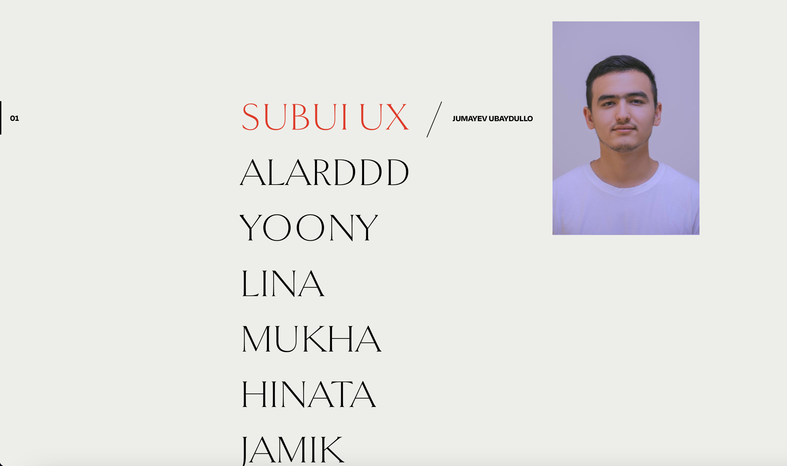

# Gsap Image Hover Menu




## Installation

Install dependencies:

```
npm install
```

Compile the code for development and start a local server:

```
npm start
```

Create the build:

```
npm run build
```

_________________________________


<h4>by SubUx</h4>